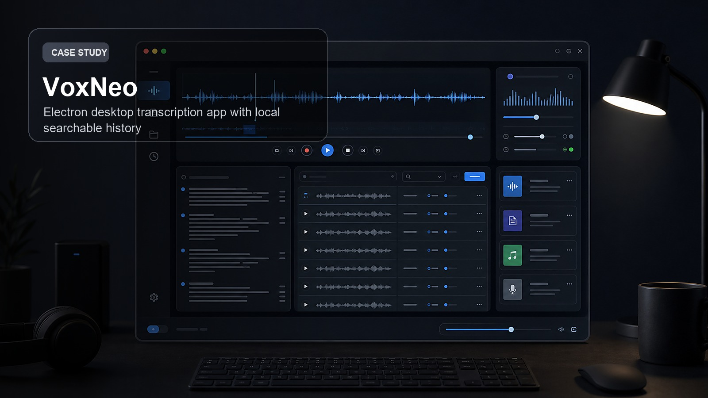
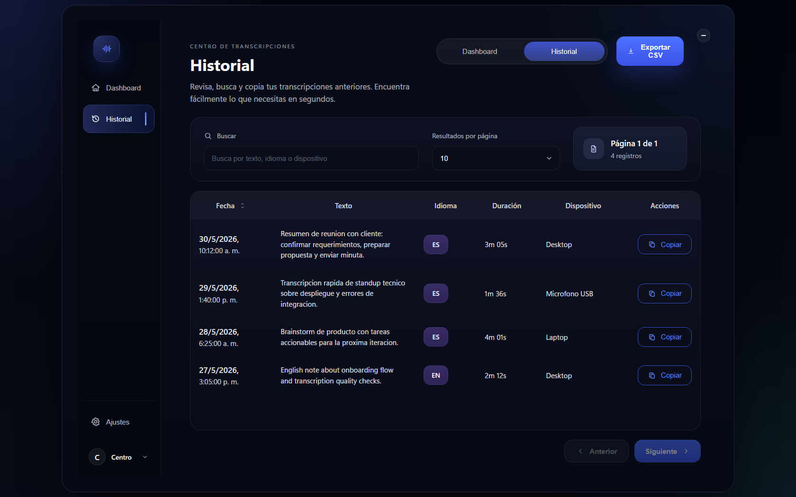

# VoxNeo

VoxNeo is a Windows desktop transcription app built with Electron, Vite, React and TypeScript. It captures audio, sends it to Groq Whisper for transcription, and gives the user a floating overlay plus a searchable local history.



Portfolio cover generated for presentation. Runtime screenshot:



## Features

- Floating overlay that shows recording/transcription state.
- System tray controls for history, settings and exit.
- Configurable global shortcuts for starting and stopping transcription.
- Automatic clipboard copy and local SQLite persistence.
- Searchable history with favorites, export paths and filters.
- Optional webhook sync paths.

## Stack

- Electron
- React
- TypeScript
- Vite
- SQLite with `better-sqlite3`
- Groq Whisper API
- Tailwind/CSS modules
- electron-store

## Run locally

```bash
npm install
npm run dev
```

For browser-only renderer previews:

```bash
npx vite dev --host 127.0.0.1 --port 3000
```

The full desktop app should be launched through Electron because the renderer depends on preload APIs exposed by the main process.

## Key areas

- `src/main`: Electron main process, windows, tray, shortcuts and transcription orchestration.
- `src/preload`: context bridge APIs.
- `src/renderer`: overlay, history dashboard and settings UI.
- `src/shared`: shared contracts and types.

## Privacy notes

Audio is captured locally and sent to Groq for transcription. Transcripts are stored in a local SQLite database under the user's app data directory.
